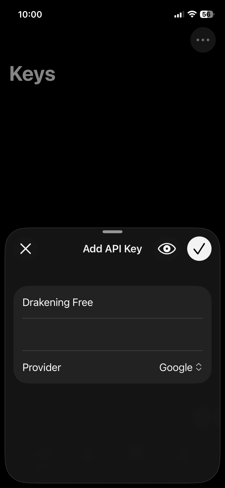

# Quickstart

## tl;dr
1. Add an API key in the *Keys* tab
2. Add a Config in the *Configs* tab
	1. Select Model Class
	2. Set the API key
3. Create a new chat in the *Chats* tab
	1. Set text/image config for the chat
	2. Start chatting!

## Long Version
1. Open Powerchat
2. Navigate to *Keys* tab in the tab bar at the bottom
3. Tap the plus sign at the bottom right corner to add an API key
4. Enter the key name, API key, and provider
	- Some providers might ask you to enter other details, such as a URL

5. Navigate to *Configs* tab
6. Tap the plus sign at the bottom right to add a config
7. Choose your *Model Class* (Claude, DeepSeek, Gemini, etc.)
8. Doing so will take you to the config view, where you can set the config name, API key, and tweak parameters
	- You must set the API key
	- Provider of the API key must match the provider of the model, otherwise the key will not show up in the API key picker
9. Once configured, exit out of the config view
10. Navigate to *Chats* tab
11. Tap the plus sign at the bottom right to create a new chat
12. Choose a text or image config
	- (Optional) Add a chat title
	- (Optional) Choose a folder for the chat
13. Tap the checkmark to start the chat
14. Enter your prompt in the message field at the bottom
15. Tap on the *Send* button (up arrow) to send the prompt
	- (Optional) If you have selected an image model, you can hold the send button to pick the output modality of the model (text or image)
