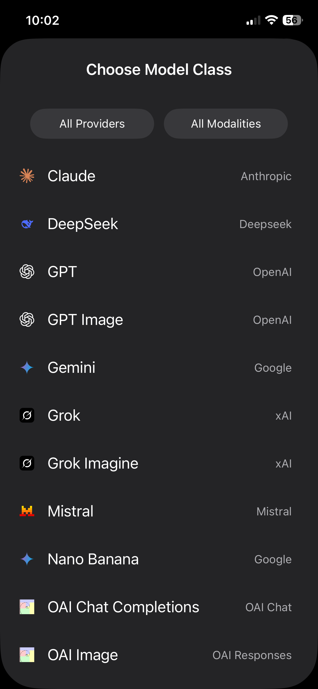
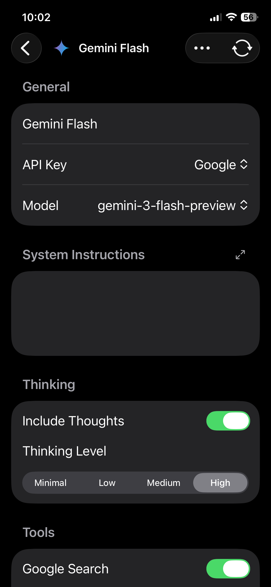
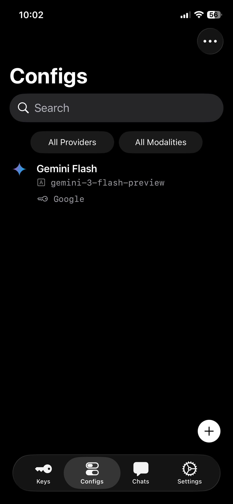
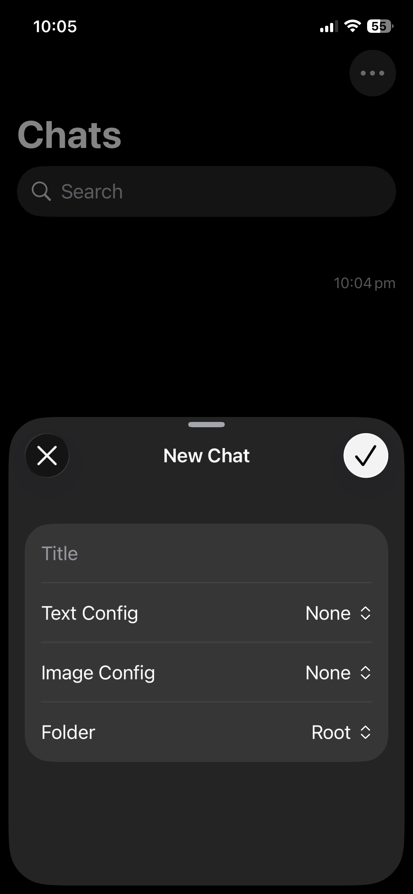
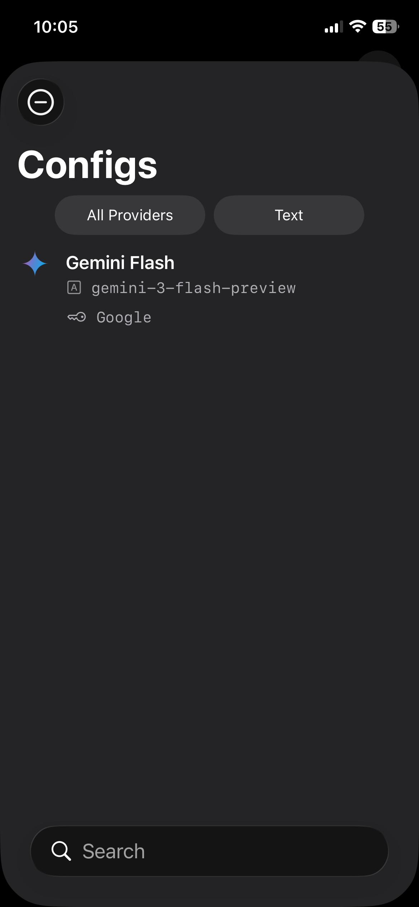
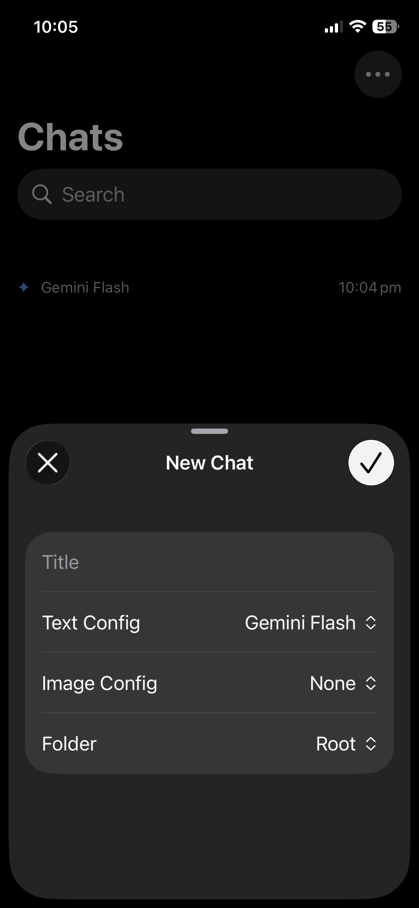

PowerChat is a privacy-first, bring-your-own-key AI chat app with model configuration options and local per-folder customizable RAG databases. It can be used to generate text and images using cloud models (Gemini, Deepseek, etc.) and local models (through Ollama), or any OpenAI compatible endpoint.

# Quickstart

## tl;dr
- Add an API key in the *Keys* tab
- Add a Config in the *Configs* tab
	- Select Model Class
	- Set the API key
- Create a new chat in the *Chats* tab
	- Set text/image config for the chat
	- Start chatting!

## Long Version
- Open PowerChat
- Navigate to *Keys* tab in the tab bar at the bottom
- Tap the plus sign at the bottom right corner to add an API key
- Enter the key name, API key, and provider
	- Some providers might ask you to enter other details, such as a URL
    
    

- Navigate to *Configs* tab
- Tap the plus sign at the bottom right to add a config
- Choose your *Model Class* (Claude, DeepSeek, Gemini, etc.)
    
    

- Doing so will take you to the config view, where you can set the config name, API key, and tweak parameters
	- You must set the API key
	- Provider of the API key must match the provider of the model, otherwise the key will not show up in the API key picker
    
    
	
- Once configured, exit out of the config view
    
    

- Navigate to *Chats* tab
- Tap the plus sign at the bottom right to create a new chat
    
    

- Choose the config you created.
	- (Optional) Add a chat title
	- (Optional) If you have created a folder, choose a folder for the chat
    
    
    
    

- Tap the checkmark to start the chat
- Enter your prompt in the message field at the bottom
- Tap on the *Send* button (up arrow) to send the prompt
	- (Optional) If you have selected an image model, you can hold the send button to pick the output modality of the model (text or image)

	<video controls width="100%">
  	<source src="./demos/quickstart.MP4" type="video/mp4">
  		Your browser does not support the video tag.
	</video>
